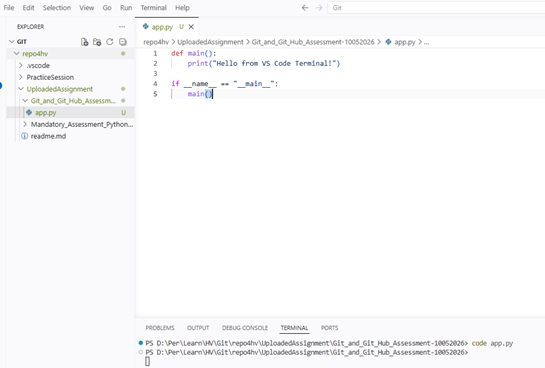
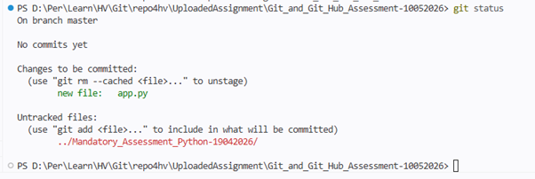
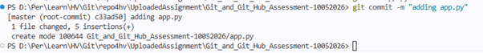
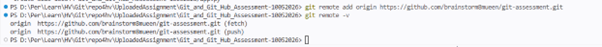
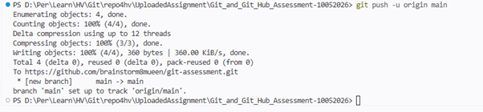

# Git & GitHub Assessment – Python Project
==========================================

## 📌 Overview
This repository is created as part of a **Git & GitHub assessment** to demonstrate practical knowledge of core Git concepts and workflows using a simple Python application.

## 📁 Git_and_Git_Hub_Assessment-10052026
```
.
├── app.py        # Sample Python application
└── README.md     # Project documentation
```

## 🚀 Getting Started

### Clone the Repository
```terminal
git clone https://github.com/brainstorm8mueen/repo4hv.git
cd .\UploadedAssignment\
```

## ✅ Assessment Tasks Covered

🎯 Question 1: Project Initialization & First Push
Objective
Set up a new Git project and push it to a remote repository.
Scenario
You are starting a new Python project. You need to track your work using Git and upload it to a remote repository.
Tasks
:one:	Create a new folder for your project
```terminal
mkdir Git_and_Git_Hub_Assessment-10052026
cd Git_and_Git_Hub_Assessment-10052026
```
:two:	Initialize a Git repository
```terminal
git init
```
:three:	Create a file named app.py and add some Python code
```terminal
code app.py
```
```python
def main():
    print("Hello from VS Code Terminal!")
if __name__ == "__main__":
    main()
```

:four: Check the current Git status
```terminal
git status
```

:five:	Stage the file
```terminal
git add app.py
```
:six:	Commit with a meaningful message
```terminal
git commit -m "adding app.py"
```

:seven:	Create a remote repository (GitHub or similar)
created remote repository git-assessment as below:
```terminal
https://github.com/brainstorm8mueen/git-assessment.git
```
:eight:	Add the remote (origin) to your local repo
```terminal
git remote add origin https://github.com/brainstorm8mueen/git-assessment.git
```
:nine:	Verify the remote configuration
```terminal
git remote -v
```

:ten:	Push your code to the remote repository
```terminal
git branch -M main
git push -u origin main
```

