# Git & GitHub Assessment – Python Project
==========================================

## 📌 Overview
This repository is created as part of a **Git & GitHub assessment** to demonstrate practical knowledge of core Git concepts and workflows using a simple Python application.

## 📁 Git_and_Git_Hub_Assessment-10052026
```
.
├── app.py        # Sample Python application
└── README.md     # Project documentation
```

## 🚀 Getting Started

### Clone the Repository
```terminal
git clone https://github.com/brainstorm8mueen/repo4hv.git
cd .\UploadedAssignment\
```

## ✅ Assessment Tasks Covered
----------------------------------------------------------------------------------------------------------------------------------------------
## 🎯 **Question 1: Project Initialization & First Push**

**Objective**
Set up a new Git project and push it to a remote repository.

**Scenario**
You are starting a new Python project. You need to track your work using Git and upload it to a remote repository.

**Tasks**

#### **:one:	Create a new folder for your project**
```terminal
mkdir Git_and_Git_Hub_Assessment-10052026
cd Git_and_Git_Hub_Assessment-10052026
```
#### **:two:	Initialize a Git repository**
```terminal
git init
```
#### **:three:	Create a file named app.py and add some Python code**
```terminal
code app.py
```
```app.py
def main():
    print("Hello from VS Code Terminal!")
if __name__ == "__main__":
    main()
```


#### **:four: Check the current Git status**
```terminal
git status
```


#### **:five:	Stage the file**
```terminal
git add app.py
```
#### **:six:	Commit with a meaningful message**
```terminal
git commit -m "adding app.py"
```


#### **:seven:	Create a remote repository (GitHub or similar)**
created remote repository git-assessment as below:
```terminal
https://github.com/brainstorm8mueen/git-assessment.git
```
#### **:eight:	Add the remote (origin) to your local repo**
```terminal
git remote add origin https://github.com/brainstorm8mueen/git-assessment.git
```
#### **:nine:	Verify the remote configuration**
```terminal
git remote -v
```


#### **:keycap_ten:	Push your code to the remote repository**
```terminal
git branch -M main
git push -u origin main
```

----------------------------------------------------------------------------------------------------------------------------------------------
## 🎯 **Question 2: Working with Changes & History**

**Objective**
Track code changes and manage commit history properly.

**Scenario**
You are enhancing your existing app.py application with new features.

**Tasks**

#### **:one:	Modify app.py by adding new functionality**
```app.py
def greet(name):
    return f"Hello, {name}!"
def main():
    print("Hello, Git World! from VS Code Terminal!")
    print(greet("Mueen"))   
if __name__ == "__main__":
    main()
```
#### **:two:	Check what changes are made before staging**
```terminal
git status
```
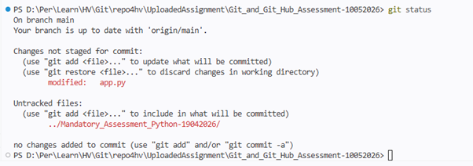

#### **:three:	View differences in the file**
```terminal
git diff
```
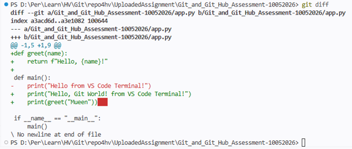

#### **:four:	Stage only specific changes (if possible)**
```terminal
git add -p
```
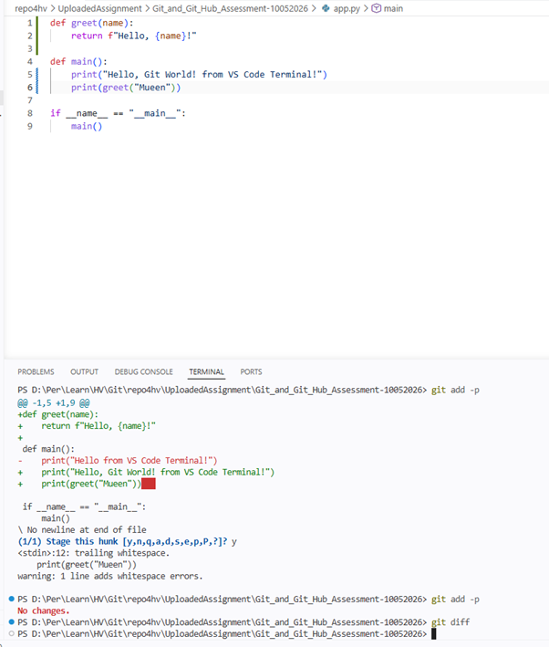

📝: It's not related to the question section; it was my mistake, as I removed unnecessary spaces.

#### **:five:	Commit with a clear message**
```terminal
git commit -m "Add greet function and enhance app output"
```
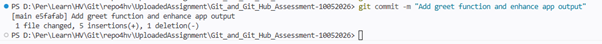

#### **:six:	Make another change in app.py**
```app.py
def greet(name):
    return f"Welcome, {name}!"
def main():
    print("Hello, Git World! from VS Code Terminal!")
    print(greet("Mueen")) 
if __name__ == "__main__":
    main()
```

#### **:seven:    Stage all changes**
```terminal
git add .
```

#### **:eight:	Commit again**
```terminal
git commit -m "Update greeting message"
```
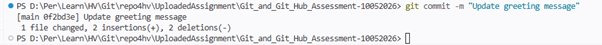

#### **:nine:	View full commit history**
```terminal
git log
```
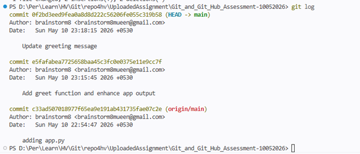

#### :keycap_ten:	View compact (one-line) history
```terminal
git log –oneline
```
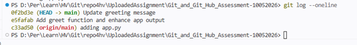
----------------------------------------------------------------------------------------------------------------------------------------------
## 🎯 Question 3: Branching & Feature Development

**Objective**
Work with branches and manage feature development.

**Scenario**
You are developing a new feature separately to avoid affecting the main code.

**Tasks**

#### **:one:	Create a new branch (e.g., feature-update)**
```terminal
git branch feature-update
```
#### **:two:	Switch to the new branch**
```terminal
git switch feature-update
```
#### **:three:	Modify app.py with new feature logic**
```app.py
def calculate_sum(a, b):
    return a + b
def greet(name):
    return f"Welcome, {name}!"
def main():
    print("Hello, Git World! from VS Code Terminal!")
    print(greet("Mueen"))
    result = calculate_sum(5, 3)
    print(f"Sum is: {result}")
if __name__ == "__main__":
    main()
```

#### **:four:	Stage and commit the changes**
```terminal
git status
git add app.py
git commit -m "Add calculate_sum feature"
```
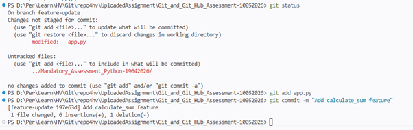

#### **:five:    Switch back to the main branch**
```terminal
git switch main
```
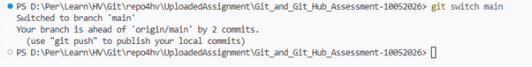

#### **:six:	Merge the feature branch into main**
```terminal
git merge feature-update
```
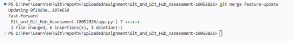

#### **:seven:	Verify changes are merged**
```terminal
git log --oneline
```
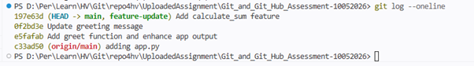

#### **:eight:	Delete the branch safely**
```terminal
git branch -d feature-update
```


#### **:nine:	Try force deleting a branch (create a dummy branch for this)**
```terminal
git branch temp-branch
git branch -D temp-branch
```
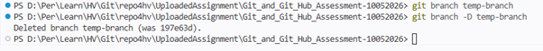

----------------------------------------------------------------------------------------------------------------------------------------------
## 🎯 Question 4: Handling Errors (Stash, Reset, Revert)

**Objective**
Learn how to manage mistakes and unfinished work.

**Scenario**
You are in the middle of development but need to handle urgent changes and fix mistakes.

**Tasks**

#### **:one:	Make changes to app.py but do NOT commit**
Add top below line in existing app.py
```app.py
def debug_message():
    print("Work in progress...")
```
    
#### **:two:	Stash the changes (include untracked files)**
```terminal
git stash push -u -m "WIP: debug message work"
```
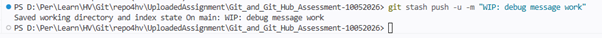

#### **:three:	Check the stash list**
```terminal
git stash list
```

#### **:four:	Apply the stashed changes back**
```terminal
git stash apply "stash@{0}"
```
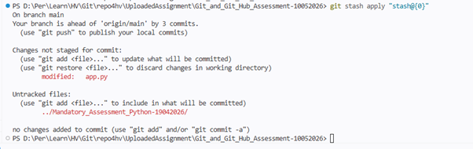

#### **:five:	Commit the changes**
```terminal
git status
git add app.py
git commit -m "Add debug message functionality"
```
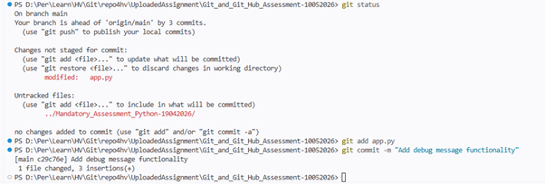

#### **:six:	Make another commit with incorrect code**
Added in existing file:
```app.py
def broken_function(
    print("This will cause a syntax error")
```
```terminal
git add app.py
git commit -m "Add broken function (mistake)"
```

#### **:seven:	Undo the last commit using reset**
```terminal
git reset --hard HEAD~1
```

#### **:eight:	Make another commit**
Added in existing file
```app.py
def fixed_function():
    print("This function works correctly")
```
```terminal
git add app.py
git commit -m "Fix broken function"
```
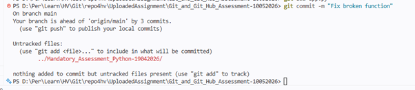

#### **:nine:	Undo a commit using revert (create a new reversing commit)**
```terminal
git revert HEAD
```
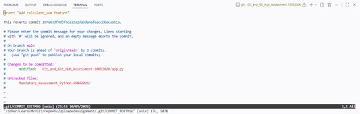

#### **:keycap_ten:	Verify the commit history**
```terminal
git log –oneline
```
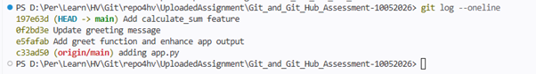

----------------------------------------------------------------------------------------------------------------------------------------------
----------------------------------------------------------------------------------------------------------------------------------------------

## 🛠️ Git Commands Used
```bash
git init
git status
git add .
git add -p
git commit -m "message"
git log
git log --oneline
git branch
git switch
git merge
git stash
git reset
git revert
git push
```

----------------------------------------------------------------------------------------------------------------------------------------------

## 📚 Technologies Used
- Git
- GitHub
- Python 3

----------------------------------------------------------------------------------------------------------------------------------------------

## 👤 Author
**Mueen Aziz Bhombal**  
Senior IT Engineer

----------------------------------------------------------------------------------------------------------------------------------------------

## 📝 Notes
- This repository is created for **learning and assessment purposes**.
- Commit messages follow best practices for clarity and traceability.

----------------------------------------------------------------------------------------------------------------------------------------------
